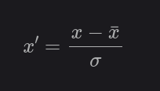

# Scaling Data
Các điểm dữ liệu đôi khi được đo đạc với những đơn vị khác nhau, m và feet chẳng hạn.

Hoặc có hai thành phần (của vector dữ liệu) chênh lệch nhau quá lớn, một thành phần có khoảng giá trị từ 0 đến 1000, thành phần kia chỉ có khoảng giá trị từ 0 đến 1 chẳng hạn.

Lúc này, chúng ta cần chuẩn hóa dữ liệu trước khi thực hiện các bước tiếp theo.

Scale data bằng kỹ thuật normalization hoặc standardization.

---
## Data Normalization
Normalization là phương pháp scale dữ liệu từ miền giá trị bất kì sang miền giá trị nằm trong khoảng 0 đến 1.

Ta cần xác định được giá trị lớn nhất (max) và giá trị nhỏ nhất (min) của dữ liệu.

Giá trị được normalize theo công thức sau:

```
y = (x - min) / (max - min)
```

### Code
Có thể thực hiện normalize dữ liệu sử dụng thư viện scikit-learn với MinMaxScaler.

```python
from sklearn.preprocessing import MinMaxScaler

sc = MinMaxScaler()
```

Để dữ liệu huấn luyện xác định giá trị max và min, gọi hàm `fit()`.

```python
# data là tập dữ liệu gốc.
fit_data = sc.fit(data)
```

Tiến hành scale dữ liệu bằng cách gọi hàm `transform()`.

```python
normalized = sc.transform(fit_data)
```

Hoặc có thể gộp chung và sử dụng hàm `fit_transform()` như sau:

```python
# data là tập dữ liệu gốc.
normalized = sc.fit_transform(data)
```

Để đảo ngược miền giá trị sau khi scale về miền giá trị gốc, gọi hàm `inverse_transform()`

```python
inverse = sc.inverse_transform(normalized)
```

---
## Data Standardization
Chuẩn hóa dữ liệu là việc scale dữ liệu về một phân bố trong đó giá trị trung bình của các quan sát bằng 0 và độ lệch chuẩn = 1.

Nhờ việc chuẩn hóa, các thuật toán như linear regression, logistic regression được cải thiện.

Công thức chuẩn hóa như sau:



với x̄ và σ lần lượt là kỳ vọng và phương sai (standard deviation) của thành phần đó trên toàn bộ training data.

Công thức chuẩn hóa:

```
y = (x - mean) / standard_deviation
```

Trong đó mean được tính như sau:

```
mean = sum(x) / count(x)
```

Để tính độ lệch chuẩn (standard_deviation):

```
standard_deviation = sqrt( sum( (x - mean)^2 ) / count(x))
```

### Code
Có thể chuẩn hóa dữ liệu bằng thư viện scikit-learn với StandardScaler:

```python
from sklearn.preprocessing import StandardScaler

sc = StandardScaler()
```

Fit dữ liệu với `fit()`.

```python
# data là tập dữ liệu gốc.
fit_data = sc.fit(data)
```

Tiến hành scale dữ liệu bằng cách gọi hàm `transform()`.

```python
standardized = sc.transform(fit_data)
```

Hoặc có thể gộp chung và sử dụng hàm `fit_transform()` như sau:

```python
# data là tập dữ liệu gốc.
standardized = sc.fit_transform(data)
```

Để đảo ngược miền giá trị sau khi scale về miền giá trị gốc, gọi hàm `inverse_transform()`

```python
inverse = sc.inverse_transform(standardized)
```

---
## Conclusion
- Vì các trọng số nhỏ của mô hình nhỏ và được cập nhật dựa vào lỗi dự đoán nên việc scale giá trị của đầu vào X và đầu ra Y của tập dữ liệu huấn luyện là một yếu tố quan trọng. Nếu đầu vào không được scaling có thể dẫn đến quá trình huấn luyện không ổn định. Ngoài ra nếu đầu ra Y không được scale trong các bài toán regression có thể dẫn đến exploding gradient khiến thuật toán không chạy được.
- Scaling có thể tạo ra sự khác biệt giữa một mô hình kém và một mô hình tốt.

---
# More
- [HT0710-ArtA](https://github.com/HT0710)
- Repo về Machine Learning: [ML-From-Scratch](https://github.com/HT0710/ML-From-Scratch.git)
- Repo về PCA: [dsc-performing-principal-component-analysis](https://github.com/HT0710/dsc-performing-principal-component-analysis.git)
